# Terraform Docker Multi-Container App

Dieses Projekt demonstriert die Bereitstellung einer einfachen Webanwendung bestehend aus einem Nginx-Webserver und einer Node.js-API mittels Terraform und dem Docker Provider. Es nutzt alle geforderten HCL-Bausteine (Variablen, Outputs, Locals, Module) zur Strukturierung und Parametrisierung der Infrastruktur.

---

## Anwendungsfall: Eine skalierbare Webanwendung mit Nginx und einer einfachen Node.js-API

### Welches Problem löst du?

Die manuelle Bereitstellung und Verwaltung einer Multi-Container-Anwendung auf einem lokalen Entwicklungssystem ist fehleranfällig, zeitaufwendig und schwer reproduzierbar. Jede Änderung an der Konfiguration der Container, Netzwerke oder Port-Mappings erfordert manuelle Schritte, die zu Inkonsistenzen zwischen verschiedenen Umgebungen oder sogar zwischen Entwicklern führen können. Dieses Projekt löst das Problem der **inkonsistenten und ineffizienten Bereitstellung** durch die Automatisierung des gesamten Prozesses.

### Warum Terraform/IaC dafür?

Terraform bietet eine deklarative Möglichkeit, die gewünschte Endzustand der Infrastruktur zu beschreiben. Für diesen Anwendungsfall sind die Vorteile von Infrastructure as Code (IaC) entscheidend:

* **Automatisierung:** Statt manuelle `docker run`-Befehle oder Skripte zu nutzen, wird die gesamte Docker-Infrastruktur (Netzwerk, Nginx-Container, Node.js-Container) mit einem einzigen `terraform apply`-Befehl erstellt. Das spart Zeit und eliminiert menschliche Fehler.
* **Reproduzierbarkeit:** Der Terraform-Code ist die Single Source of Truth für die Infrastruktur. Jeder, der den Code ausführt, erhält die exakt gleiche Umgebung. Dies ist essenziell für die Konsistenz zwischen Entwicklungs-, Test- und ggf. Produktionsumgebungen.
* **Versionierung:** Die Infrastrukturdefinition wird wie Anwendungs-Code in einem Versionskontrollsystem (z.B. Git) verwaltet. Dies ermöglicht Änderungsnachverfolgung, Rollbacks und Kollaboration.
* **Parametrisierung und Flexibilität:** Durch die Nutzung von Variablen kann die Konfiguration leicht angepasst werden, ohne den Kern-Code zu ändern. Dies ist besonders nützlich, wenn sich z.B. Docker-Image-Versionen ändern oder die Anwendung auf unterschiedlichen Host-Ports laufen soll.
* **Modellierung komplexer Abhängigkeiten:** Terraform versteht die Abhängigkeiten zwischen den Ressourcen (z.B. ein Container benötigt ein Netzwerk). Es stellt sicher, dass Ressourcen in der richtigen Reihenfolge erstellt werden.

---

## Umgesetzte Lösung

Die Lösung implementiert eine Zwei-Tier-Webanwendung auf Docker.

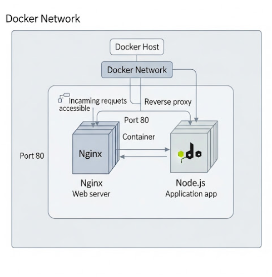

* **`docker_network.app_network`**: Erstellt ein isoliertes Docker-Netzwerk, in dem die Container kommunizieren können. Dies sorgt für eine bessere Isolation und Organisation der Anwendungskomponenten.
* **`module.nginx_service`**: Repräsentiert den Nginx-Webserver. Dieser Container agiert als Reverse Proxy und leitet Anfragen vom Host-Port (z.B. 8080) an die Node.js-App im internen Netzwerk weiter. Er verwendet ein generisches `nginx:latest`-Image.
* **`module.node_app_service`**: Repräsentiert die Backend-Anwendung. Dieser Container läuft die Node.js-App und ist nur innerhalb des Docker-Netzwerks erreichbar. Aktuell ist dies ein Dummy-Container, der nur eine Nachricht ausgibt, aber er kann leicht durch ein echtes Node.js-App-Image ersetzt werden.

---

## Anwendung der gelernten Konzepte

### Variablen (`variables.tf`)

Variablen dienen dazu, unsere Konfiguration **dynamisch und wiederverwendbar** zu gestalten, anstatt hardgecodierte Werte zu verwenden.

* `project_prefix` (string): Wird verwendet, um eindeutige Namen für Ressourcen zu generieren (z.B. `webapp-app-network`). Dies verhindert Namenskollisionen, wenn mehrere Terraform-Projekte auf demselben Docker-Host laufen. Ohne diese Variable müssten wir jeden Namen manuell ändern, was fehleranfällig wäre.
* `network_name` (string): Definiert den Basisaname für das Docker-Netzwerk. Ermöglicht die einfache Umbenennung des Netzwerks ohne Code-Änderungen in `main.tf`.
* `nginx_image` (string): Definiert das Docker Image für Nginx. Erlaubt es, schnell verschiedene Nginx-Versionen zu testen oder von `nginx:latest` zu einer spezifischen Version wie `nginx:1.27.5` zu wechseln, ohne die Ressourcendefinition selbst anzupassen.
* `nginx_host_port` (number): Legt den Host-Port fest, auf den Nginx gemappt wird. Dies ist entscheidend, um die Anwendung auf einem anderen Port bereitzustellen, wenn der Standard-Port belegt ist oder mehrere Anwendungen auf dem Host laufen. `number` als Typ erzwingt, dass ein gültiger Port angegeben wird.
* `node_app_image` (string): Definiert das Docker Image für die Node.js App. Ähnlich wie `nginx_image` ermöglicht dies den schnellen Austausch des Anwendungs-Images.
* `node_app_container_port` (number): Definiert den internen Port, auf dem die Node.js App innerhalb ihres Containers lauscht.
* `node_app_command` (list(string)): Eine Liste von Strings, die den Befehl und seine Argumente darstellen, der beim Start des Node.js-Containers ausgeführt wird. Der Typ `list(string)` ist hier wichtig, um flexible Startbefehle zu ermöglichen.

Ohne Variablen wäre unsere Konfiguration statisch und müsste bei jeder kleinen Änderung (z.B. ein anderer Port oder ein neues Image) direkt in den Ressourcendefinitionen angepasst werden, was mühsam und fehleranfällig ist.

### Outputs (`outputs.tf`)

Outputs machen wichtige Informationen über die erstellte Infrastruktur nach dem `terraform apply` für den Benutzer zugänglich.

* `network_id`: Gibt die eindeutige ID des erstellten Docker-Netzwerks aus. Dies ist nützlich für Debugging oder wenn andere Skripte oder Tools diese ID benötigen. Ohne diesen Output müsste man `docker network ls` ausführen, um die ID herauszufinden.
* `nginx_access_url`: Zeigt die vollständige URL an, unter der der Nginx-Webserver auf dem Host erreichbar ist. Dies ist eine direkte Rückmeldung an den Benutzer und spart das manuelle Zusammenfügen von `localhost` und dem `nginx_host_port`.

Outputs verbessern die **Benutzerfreundlichkeit und Automatisierbarkeit**, da sie relevante Informationen strukturiert bereitstellen.

### Locals (`main.tf`)

Locals definieren benannte Ausdrücke, die in der Konfiguration mehrfach verwendet werden können. Sie verbessern die Lesbarkeit und vermeiden Redundanz.

* `nginx_container_name` und `node_app_container_name`: Diese Locals konstruieren die vollständigen Namen der Docker-Container, indem sie das `project_prefix` mit dem spezifischen Dienstnamen verbinden. Anstatt `"${var.project_prefix}-nginx"` jedes Mal neu zu schreiben, wenn wir den Namen des Nginx-Containers referenzieren, können wir einfach `local.nginx_container_name` verwenden. Dies sorgt für **Konsistenz** in der Benennung und macht Änderungen des Präfixes an einer zentralen Stelle wirksam.

Locals sind sinnvoll, um **komplexe Ausdrücke zu vereinfachen** oder **wiederverwendbare berechnete Werte** zu definieren, die die Konfiguration übersichtlicher machen.

### Module (`modules/docker-service/`)

Module kapseln und organisieren Terraform-Konfigurationen für **Wiederverwendung und Strukturierung**.

* **`docker-service` Modul:** Dieses Modul abstrahiert die Logik für die Bereitstellung eines einzelnen Docker-Containers und dessen Anbindung an ein Netzwerk. Es enthält:
    * Eine `docker_container` Ressource
    * Eine `docker_network_attachment` Ressource
    * Spezifische Variablen (`container_name`, `image`, `network_id`, `ports`, `command`) für die Konfiguration des Dienstes.
    * Outputs (`container_id`, `container_name`) für den Zugriff auf Modul-spezifische Informationen.

**Warum sinnvoll?**
Statt die `docker_container` und `docker_network_attachment` Ressourcen für jeden Dienst (Nginx, Node.js App) einzeln und redundant in `main.tf` zu definieren, verwenden wir das `docker-service`-Modul.

* **Wiederverwendung:** Wenn wir in Zukunft weitere Microservices hinzufügen möchten, können wir einfach eine weitere Instanz des `docker-service`-Moduls in `main.tf` definieren, anstatt den gesamten Code zu kopieren. Das spart Zeit und reduziert Fehler.
* **Strukturierung:** Das Modul gruppiert logisch zusammengehörige Ressourcen und Parameter. Dies macht die `main.tf` wesentlich lesbarer und fokussiert sie auf die Komposition der Anwendung, anstatt auf die Details einzelner Container-Bereitstellungen. Es ist klarer, dass wir zwei "Dienste" bereitstellen, anstatt nur zwei separate Container.
* **Abstraktion:** Die Komplexität der Container-Erstellung und Netzwerkanbindung ist im Modul gekapselt. Der Benutzer des Moduls muss sich nur um die Eingabeparameter des Dienstes kümmern.

Ohne Module würde unsere `main.tf` schnell unübersichtlich werden, insbesondere bei komplexeren Anwendungen mit vielen Containern. Module sind essentiell für **Skalierbarkeit und Wartbarkeit** von Terraform-Projekten.

---

## Vergleich zu Vorkenntnissen

### Manuelle Schritte / Bash-Skripte

Manuell würde die Erstellung der Infrastruktur etwa so aussehen:

```bash
# Netzwerk erstellen
docker network create webapp-app-network

# Node.js App Container (dummy)
docker run -d --name webapp-node-app --network webapp-app-network alpine/git sh -c "echo 'Hello from Node.js app!' && sleep infinity"

# Nginx Container
docker run -d --name webapp-nginx --network webapp-app-network -p 8080:80 nginx:latest

# Konfiguration von Nginx (manuell in den Container kopieren oder Volume mounten)
# ... dies wäre ein weiterer manueller Schritt
```

### Unterschiede zu Terraform:

* Vorgehen: Imperativ (Schritt für Schritt, wie es gemacht werden soll) vs. Deklarativ (Beschreibung des gewünschten Zustands).
* Syntax: Shell-Befehle vs. HCL (Human-readable Configuration Language).
* Konzepte: Keine native Verwaltung von Abhängigkeiten, kein State-Management, kein Plan.
* Vor-/Nachteile: Manuelle Schritte sind für einmalige, einfache Aufgaben schnell. Für komplexe, wiederholbare oder versionierte Infrastruktur sind sie extrem ineffizient und fehleranfällig. Terraform bietet hier eine überlegene Kontrolle, Transparenz und Automatisierung.

### CloudFormation (AWS) / ARM (Azure)
Diese Tools sind ebenfalls IaC-Lösungen, aber Cloud-Provider-spezifisch.

### Unterschiede zu Terraform:

* Vorgehen: Deklarativ, ähnlich wie Terraform.
* Syntax: JSON/YAML (CloudFormation), JSON (ARM) vs. HCL (Terraform). HCL ist oft als lesbarer und intuitiver wahrgenommen.
* Konzepte: Ähnliche Konzepte wie Ressourcen, Parameter (Variablen), Outputs. Module/Nested Stacks existieren, sind aber manchmal komplexer zu handhaben als Terraform-Module.
* Vor-/Nachteile: CloudFormation/ARM sind tief in ihre jeweiligen Cloud-Ökosysteme integriert und bieten oft sofortige Unterstützung für neue Dienste. Terraform ist Provider-agnostisch, was bedeutet, dass es eine einheitliche Syntax und einen Workflow für die Verwaltung von Infrastruktur über verschiedene Cloud-Anbieter, SaaS-Dienste und On-Premise-Lösungen (wie Docker) hinweg bietet. Dies ist ein großer Vorteil in Multi-Cloud- oder Hybrid-Cloud-Umgebungen. Für diesen spezifischen Docker-Anwendungsfall wären CloudFormation/ARM nicht direkt relevant, da sie keine Docker-Ressourcen auf einem lokalen Host verwalten können.

### Vorteile von Terraform in diesem spezifischen Fall:
* Lokal und Portabel: Terraform kann nicht nur Cloud-Ressourcen, sondern auch lokale Infrastruktur wie Docker-Container verwalten. Dies macht es ideal für lokale Entwicklungs- und Testumgebungen, die Cloud-Paradigmen folgen sollen.
* Konsistenter Workflow: Der gleiche init, plan, apply, destroy-Workflow kann für Docker-Ressourcen wie für Cloud-Ressourcen verwendet werden. Das reduziert die Lernkurve und Komplexität, wenn man später auf Cloud-Infrastruktur erweitert.
* Erweiterbarkeit: Der Docker Provider von Terraform ist flexibel und kann die meisten Docker-Funktionen abbilden.

## Schwierigkeiten
### Herausforderungen und Lösungen
* Initiales Verständnis des Modulkonzepts: Am Anfang kann es schwierig sein zu entscheiden, welche Ressourcen in ein Modul gehören und wie Variablen und Outputs zwischen dem Root-Modul und den Kind-Modulen übergeben werden.
* Lösung: Ich habe mich auf das Prinzip der Wiederverwendbarkeit konzentriert. Da sowohl Nginx als auch die Node.js-App grundlegend "Container, die mit einem Netzwerk verbunden sind", sind, ergab sich ein generisches "docker-service"-Modul. Klare Variablen- und Output-Definitionen in den Modulen sind entscheidend für ihre Nutzbarkeit.
* Abhängigkeiten zwischen Ressourcen: Terraform ist exzellent darin, Abhängigkeiten automatisch zu erkennen. Manchmal muss man jedoch explizite depends_on hinzufügen, wenn eine Ressource eine andere vollständig bereit sein muss, bevor sie konfiguriert werden kann, auch wenn Terraform das nicht implizit erkennt. (In diesem Fall waren keine expliziten depends_on nötig, da Terraform die Abhängigkeiten von Container zum Netzwerk und Netzwerk-Attachment zu Container gut erkennt.)
* Lösung: Gründliches Prüfen des terraform plan und gegebenenfalls das Hinzufügen von depends_on oder das Umstrukturieren der Ressourcen, um logische Abhängigkeiten zu berücksichtigen.
Port-Mappings für Docker-Container: Die Syntax für Port-Mappings in docker_container kann anfangs etwas gewöhnungsbedürftig sein, besonders wenn man dynamic Blöcke oder Listen von Objekten verwendet.
* Lösung: Intensive Nutzung der Terraform Docker Provider Dokumentation und Experimente mit verschiedenen Typen von Variablen (z.B. list(object) für Ports) um die flexible Definition zu ermöglichen.

### Warum ist dein Anwendungsfall "nicht-trivial"?
Dieser Anwendungsfall geht über eine triviale Ressourcendefinition hinaus, weil er:

Mehrere zusammenhängende Ressourcen (docker_network, docker_container Instanzen, docker_network_attachment Instanzen) benötigt, die in einer bestimmten Reihenfolge und mit Abhängigkeiten zueinander erstellt werden müssen.
Die Parametrisierung durch mindestens 3 verschiedene Variablentypen (string, number, list(string), list(object)) erfordert, die eine hohe Flexibilität der Konfiguration ermöglichen. Eine einfache Ressourcendefinition bräuchte kaum Variablen.
Mindestens 2 Outputs nutzt, die relevante Informationen aus der erstellten Infrastruktur extrahieren und für den Benutzer oder nachfolgende Prozesse zugänglich machen.
Mindestens 1 Locals-Block verwendet, um berechnete Werte zu zentralisieren und die Lesbarkeit und Wartbarkeit der Konfiguration zu verbessern (z.B. für die konsistente Benennung von Ressourcen).
Ein eigenes lokales Modul (docker-service) erstellt und instanziiert. Die Notwendigkeit, ein Modul zu entwickeln, zeigt das Verständnis für Wiederverwendbarkeit und Strukturierung. Eine triviale Aufgabe würde dies nicht erfordern; man würde einfach die Ressourcen direkt definieren. Die Kombination dieser Bausteine und das Verständnis, wann und wie sie sinnvoll eingesetzt werden, macht die Aufgabe zu einer Ganztagesaufgabe. Es geht nicht nur darum, jede Komponente zu definieren, sondern sie zu einem kohärenten, flexiblen und wartbaren Ganzen zu verbinden.

# Remote State Konfiguration
Dieses Terraform-Projekt ist so konfiguriert, dass es einen Remote State verwendet, um die Best Practices für das Management des Infrastrukturzustands zu erfüllen.

## Warum Remote State?
Die Nutzung eines Remote State Backends bietet signifikante Vorteile gegenüber der Standard-Methode, den Terraform State lokal zu speichern:

* Vorteile für Teams: In Teamumgebungen ermöglicht der Remote State, dass mehrere Teammitglieder gleichzeitig an der Infrastruktur arbeiten können, ohne Konflikte beim State zu verursachen. Jedes terraform plan oder terraform apply greift auf denselben zentralen State zu, was eine konsistente Sicht auf die Infrastruktur gewährleistet und "State-Drift" (abweichende Ansichten des Infrastrukturzustands) verhindert.
* Robustheit und Zuverlässigkeit: Der State wird in einem persistenten, fehlertoleranten Cloud-Storage gespeichert. Dies schützt vor lokalem Datenverlust, falls die lokale terraform.tfstate-Datei beschädigt wird oder verloren geht (z.B. durch Hardware-Defekte oder versehentliches Löschen).
* Sicherheit: Cloud-Speicher bieten in der Regel bessere Sicherheitsfunktionen (Verschlüsselung, Zugriffskontrolle) als lokale Dateisysteme.

## Gewählter Cloud Provider und Backend
Für dieses Projekt wurde AWS S3 als Remote State Backend gewählt. S3 bietet eine hochverfügbare, skalierbare und sichere Speicherlösung, die ideal für Terraform State-Dateien ist.

## Konfiguration des Backend Blocks
Der backend Block ist innerhalb des terraform Blocks in der Datei backend.tf definiert. 
backend.tf
```hcl
terraform {
  backend "s3" {
    bucket         = "my-terraform-remote-state-bucket-stephi"
    key            = "terraform/state/my-iac-project.tfstate"
    region         = "eu-central-1"    
  }
}
```
provider.tf
```hcl
terraform {
  required_providers {
    docker = {
      source  = "kreuzwerker/docker"
      version = "~> 3.6.0"
    }
    aws = { # Neuer AWS Provider Block
      source  = "hashicorp/aws"
      version = "~> 5.0" # nutze die aktuelle Version
    }
  }
}

# AWS Provider Konfiguration
provider "aws" {
  region = "eu-central-1" # Ersetze dies mit deiner gewünschten AWS Region
}
```
## Migration des States mit terraform init
Nachdem der backend Block in der Konfiguration definiert wurde, wurde der Befehl terraform init ausgeführt:

```bash
terraform init
```
Terraform erkannte dabei, dass ein Remote Backend konfiguriert war und dass bereits ein lokaler State (terraform.tfstate) existierte. Terraform fragte, ob der lokale State zum neuen Remote Backend migriert werden sollte. Diese Frage wurde mit yes beantwortet, woraufhin Terraform den gesamten Inhalt des lokalen States sicher in den konfigurierten S3-Bucket (oder Azure Blob Storage Container) verschob. Der Output des terraform init Befehls bestätigte die erfolgreiche Migration.

## Überprüfung des Remote States
Der erfolgreiche Umzug des States in die Cloud wurde wie folgt überprüft:

Ich habe mich in die AWS Management Console begeben, zum S3-Service navigiert und den zuvor erstellten Bucket (my-terraform-state-bucket-yourname-unique) geöffnet. Dort konnte ich ein Objekt mit dem Pfad und Namen terraform/state/my-iac-project.tfstate finden, was bestätigt, dass die State-Datei nun in der Cloud gespeichert ist.

## Rolle der lokalen terraform.tfstate Datei nach der Migration
Nach der erfolgreichen Migration ist die lokale terraform.tfstate-Datei entweder komplett verschwunden oder stark verkleinert. Sie enthält nun lediglich einen Verweis auf das Remote Backend. Zukünftige terraform Befehle (wie plan, apply, destroy) lesen den State direkt aus dem konfigurierten Remote Backend und schreiben Änderungen auch wieder dorthin zurück. Die lokale Datei spielt keine operative Rolle mehr für den eigentlichen Zustand der Infrastruktur.

## Sicherheitsmaßnahmen für den Remote State (AWS S3 Beispiel)
Für den S3 Bucket, der den Terraform State speichert, wurden folgende Sicherheitsmaßnahmen getroffen (Best Practices):

* Bucket Versioning: Das Versioning ist für den S3 Bucket aktiviert. Dies bietet einen Schutz vor versehentlichem Löschen oder Überschreiben des State-Files, da frühere Versionen der Datei jederzeit wiederhergestellt werden können. Dies ist entscheidend für die Wiederherstellbarkeit im Fehlerfall.
* Serverseitige Verschlüsselung (SSE-S3): Der S3 Bucket ist so konfiguriert, dass alle Objekte standardmäßig serverseitig verschlüsselt werden. Dies gewährleistet, dass die State-Datei im Ruhezustand (at-rest) in AWS verschlüsselt ist, was eine zusätzliche Sicherheitsebene darstellt.
* Block Public Access: Alle "Block Public Access"-Einstellungen sind standardmäßig aktiviert, um sicherzustellen, dass der S3 Bucket und seine Inhalte niemals öffentlich zugänglich sind.
* IAM-Berechtigungen: Der Zugriff auf den S3-Bucket wird über fein granulierte IAM-Richtlinien kontrolliert, die nur den berechtigten Benutzern oder Rollen (z.B. dem Terraform-Ausführungsbenutzer) Lese- und Schreibzugriff erlauben. z.B. my-tf-user.

Die entsprechenden Screenshots 
* terraform init
* terraform plan
* terraform apply
* S-Bucket und
* terraform destroy
sind im Ordner screenshots_remote-state hinterlegt.

# Terraform Infrastruktur Projekte

Dieses Repository enthält verschiedene Terraform-Projekte zur Infrastrukturautomatisierung.

## Projekte

### 1. Docker Multi-Container App (`terraform-docker-app/`)

Dieses Projekt demonstriert die Bereitstellung einer einfachen Webanwendung bestehend aus einem Nginx-Webserver und einer Node.js-API mittels Terraform und dem Docker Provider. Es nutzt alle geforderten HCL-Bausteine (Variablen, Outputs, Locals, Module) zur Strukturierung und Parametrisierung der Infrastruktur.

---

### 2. AWS S3 Bucket Recherche (`terraform-aws-s3-research/`)

Eine Forschungsaufgabe zur Implementierung eines S3 Buckets in AWS mit Terraform. 

**Inhalt:**
- Implementierung eines S3 Buckets mit dem offiziellen AWS S3 Bucket Modul
- Konfiguration von Versionierung und Zugriffsrechten
- Authentifizierung über Umgebungsvariablen
- Vollständige Dokumentation des Prozesses

**Ergebnisse:**
- Detaillierte Dokumentation: [`terraform-aws-s3-research/aws-s3-research.md`](terraform-aws-s3-research/aws-s3-research.md)
- Terraform-Konfiguration: [`terraform-aws-s3-research/main.tf`](terraform-aws-s3-research/main.tf)
- Screenshots der Implementierung im Verzeichnis `terraform-aws-s3-research/screenshots/`

---

### 3. AWS VPC und EC2 Instance (`terraform-aws-vpc-ec2/`)

Ein Projekt zur Erstellung einer Basic AWS Infrastruktur mit:
- Virtual Private Cloud (VPC)
- Public und Private Subnets in drei Availability Zones
- Security Group für SSH-Zugriff
- EC2 Instance (Ubuntu 24.04 LTS)

**Implementierte Ressourcen:**
- VPC mit CIDR `10.0.0.0/16`
- 3 Private Subnets: `10.0.1.0/24`, `10.0.2.0/24`, `10.0.3.0/24`
- 3 Public Subnets: `10.0.101.0/24`, `10.0.102.0/24`, `10.0.103.0/24`
- Security Group für SSH (Port 22)
- EC2 t2.micro Instance mit Ubuntu 24.04

**Projektstruktur:**
```
terraform-aws-vpc-ec2/
├── main.tf           # Hauptkonfiguration (VPC, EC2)
├── variables.tf      # Variablendefinitionen
├── outputs.tf        # Output-Definitionen
├── provider.tf       # AWS Provider Konfiguration
└── screenshots/      # Implementierungsbeweise
```

**Implementation Steps:**
1. Terraform Initialisierung: 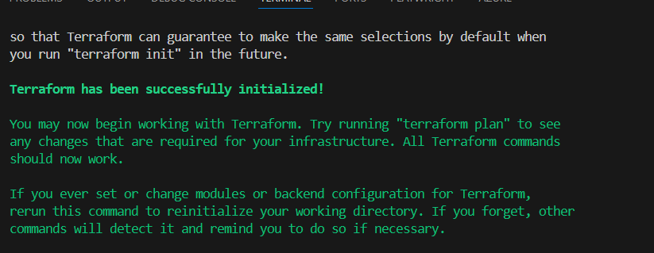
2. Ressourcen-Planung: 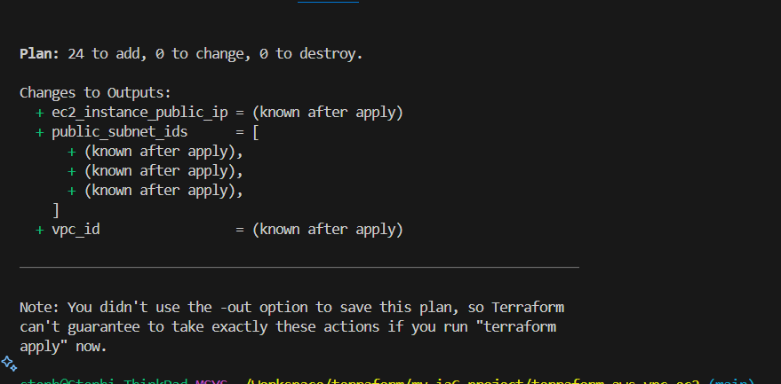
3. Infrastruktur-Erstellung: 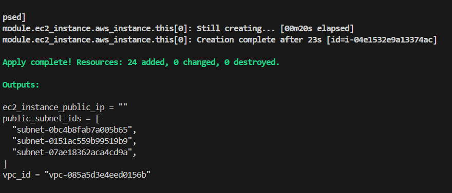

**Erstellte AWS Ressourcen:**
- VPC: 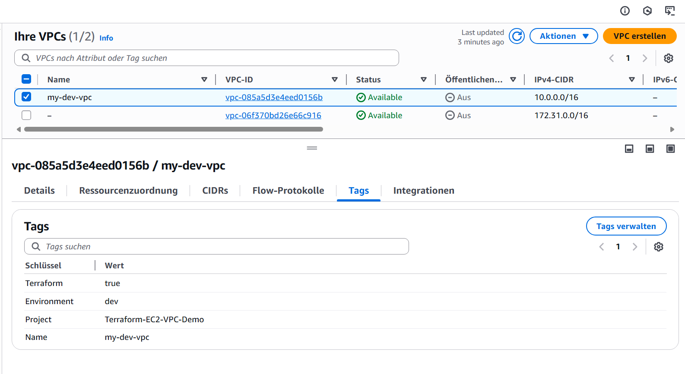
- EC2 Instance: 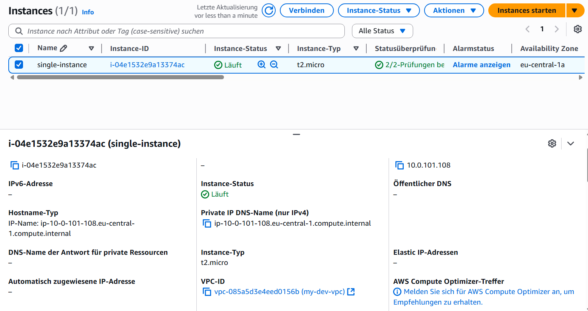
- Security Group: 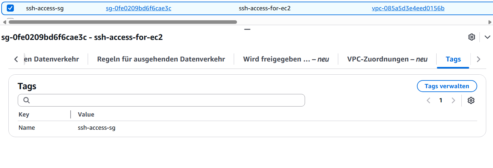
- Subnets: 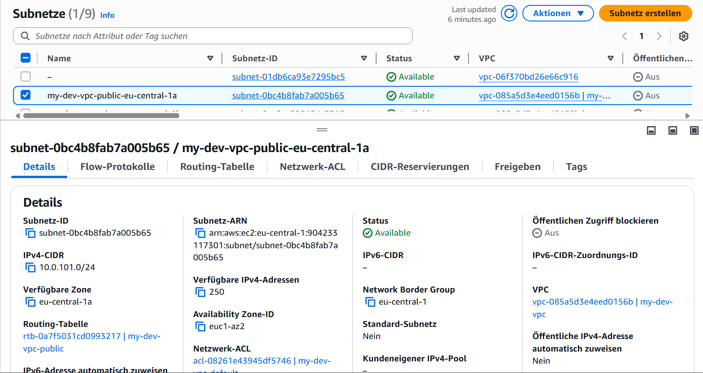

**Cleanup:**
- Destroy Command: 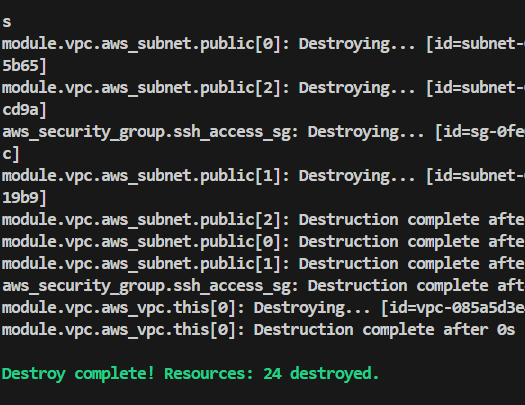
- Verified Deletion: 
  - 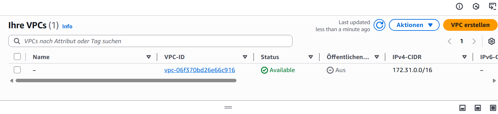
  - 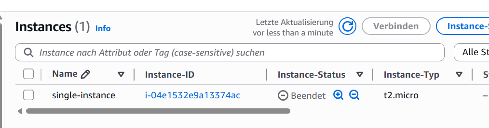
  - 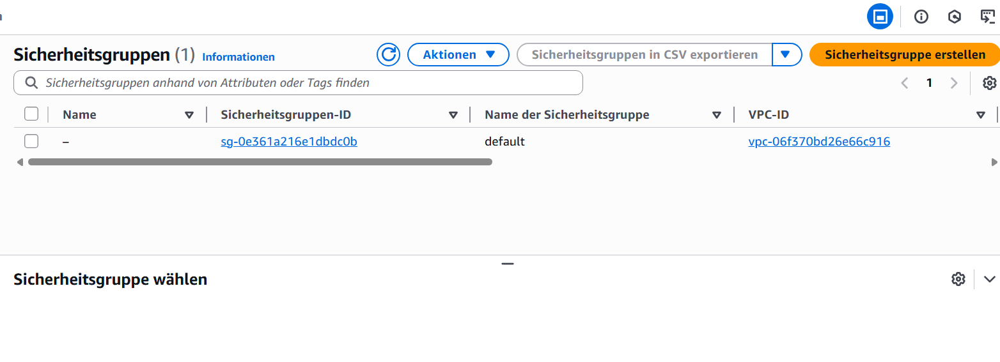

Eine detaillierte Reflexion über die Implementierung befindet sich in der [reflexion.md](terraform-aws-vpc-ec2/reflexion.md).