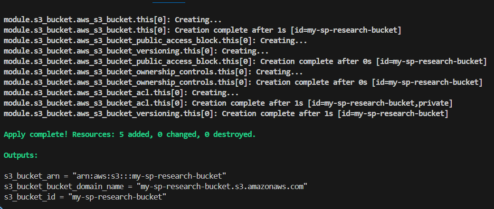
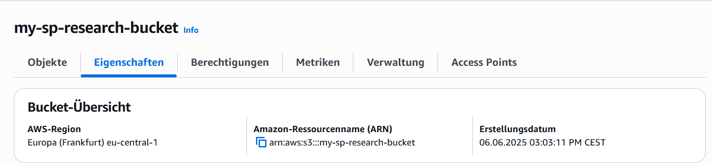
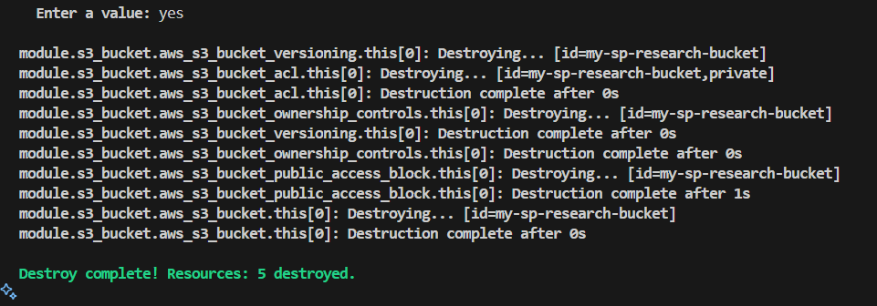
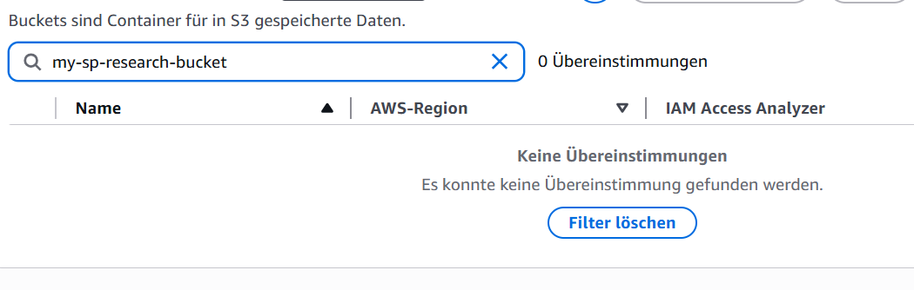

# AWS S3 Bucket Research Documentation

## AWS Provider für Terraform

### Die Rolle des AWS Providers

Der AWS Provider ist eine wichtige Komponente in Terraform, die als Brücke zwischen Terraform und der AWS-API fungiert. Er ermöglicht es Terraform:

- Mit der AWS-Infrastruktur zu kommunizieren
- AWS-Ressourcen zu erstellen, zu ändern und zu löschen
- Den aktuellen Zustand der AWS-Ressourcen zu überprüfen
- Die Authentifizierung und Autorisierung mit AWS zu handhaben

Der Provider übersetzt dabei die Terraform-Konfiguration in entsprechende AWS-API-Aufrufe.

### Konfiguration des AWS Providers

In unserem Projekt wurde der AWS Provider wie folgt konfiguriert:

```hcl
provider "aws" {
  region = "eu-central-1"
}
```

**Verwendete Argumente:**
- `region`: Definiert die AWS-Region (eu-central-1, Frankfurt), in der die Ressourcen erstellt werden sollen.

**Authentifizierung:**
Die Authentifizierung wurde über Umgebungsvariablen durchgeführt. Dies ist eine sichere Methode, da:
- Keine sensiblen Credentials im Code gespeichert werden müssen
- Die Credentials nur temporär in der Shell-Session verfügbar sind
- Die Variablen durch Export gesetzt wurden:
  ```bash
  export AWS_ACCESS_KEY_ID="[Ihre Access Key ID]"
  export AWS_SECRET_ACCESS_KEY="[Ihr Secret Access Key]"
  export AWS_REGION="eu-central-1"
  ```
*Hinweis: Die tatsächlichen Werte wurden hier durch Platzhalter ersetzt*

### Terraform Initialisierung

Nach der Konfiguration des AWS Providers wurde das Projekt mit `terraform init` initialisiert:



## Die aws_s3_bucket Ressource

### Was ist ein S3 Bucket?

Amazon S3 (Simple Storage Service) ist ein Objektspeicherdienst von AWS. Ein S3 Bucket ist dabei:
- Ein Container für Dateien (Objekte)
- Global eindeutig benannt
- Kann für verschiedene Anwendungsfälle genutzt werden:
  - Statische Webseiten
  - Backup und Archivierung
  - Datenanalyse
  - Software-Verteilung

### Implementierungsergebnis

Nach erfolgreicher Implementierung wurde der S3 Bucket in der AWS Console sichtbar:



### Die Implementierung

In dem Projekt verwende ich das offizielle AWS S3 Bucket Modul:

```hcl
module "s3_bucket" {
  source  = "terraform-aws-modules/s3-bucket/aws"
  version = "~> 3.15.1"

  bucket = "my-sp-research-bucket"
  acl    = "private"

  control_object_ownership = true
  object_ownership         = "ObjectWriter"

  versioning = {
    enabled = true
  }
}
```

**Konfigurierte Features:**
- Privater Zugriff (ACL)
- Versionierung aktiviert
- Objekt-Ownership Control

### Output Blocks

Die Konfiguration enthält mehrere Output-Blocks:

```hcl
output "s3_bucket_id" {
  description = "The name of the bucket."
  value       = module.s3_bucket.s3_bucket_id
}

output "s3_bucket_arn" {
  description = "The ARN of the bucket. Will be of format arn:aws:s3:::bucketname."
  value       = module.s3_bucket.s3_bucket_arn
}

output "s3_bucket_bucket_domain_name" {
  description = "The bucket domain name. Will be of format bucketname.s3.amazonaws.com."
  value       = module.s3_bucket.s3_bucket_bucket_domain_name
}
```

Diese Outputs liefern wichtige Informationen über den erstellten S3 Bucket:
- `s3_bucket_id`: Der Name des Buckets
- `s3_bucket_arn`: Die Amazon Resource Number (ARN) des Buckets
- `s3_bucket_bucket_domain_name`: Die Domain des Buckets für den Zugriff

## Dokumentation

### Gefundene Dokumentationsquellen

1. **AWS Provider Dokumentation:**
   - Hauptquelle: [Terraform AWS Provider Documentation](https://registry.terraform.io/providers/hashicorp/aws/latest/docs)
   - Enthält detaillierte Informationen zur Provider-Konfiguration und verfügbaren Ressourcen

2. **S3 Bucket Modul Dokumentation:**
   - [Terraform AWS S3 Bucket Module](https://registry.terraform.io/modules/terraform-aws-modules/s3-bucket/aws/latest)
   - Bietet Beispiele und Best Practices für die S3 Bucket Konfiguration

### Argument Reference vs. Attribute Reference

In der Terraform-Dokumentation gibt es zwei wichtige Abschnitte:

**Argument Reference:**
- Beschreibt die Eingabeparameter, die man in der Konfiguration verwenden kann
- Definiert, was man konfigurieren kann
- Beispiel: `bucket` (Name), `acl` (Zugriffsrechte), `versioning` (Versionierungseinstellungen)

**Attribute Reference:**
- Beschreibt die Werte, die nach der Erstellung der Ressource verfügbar sind
- Zeigt, welche Informationen man aus der erstellten Ressource auslesen kann
- Beispiel: `id` (Bucket-Name), `arn` (Amazon Resource Name), `domain_name` (S3 Domain)

## Aufräumen der Infrastruktur

### Terraform Destroy

Um unnötige Kosten zu vermeiden und die erstellte Infrastruktur wieder zu entfernen, wurde der Befehl `terraform destroy` verwendet. Dieser Befehl:
- Liest den aktuellen Zustand aus der terraform.tfstate Datei
- Plant die Löschung aller erstellten Ressourcen
- Führt nach Bestätigung die Löschung durch

Der Destroy-Prozess wurde erfolgreich ausgeführt:



### Verifizierung in der AWS Console

Nach der erfolgreichen Ausführung von `terraform destroy` wurde in der AWS Console überprüft, dass der S3 Bucket tatsächlich entfernt wurde:



Dieser letzte Schritt ist wichtig zur Verifizierung, dass keine Ressourcen zurückgeblieben sind und keine weiteren Kosten entstehen können.
